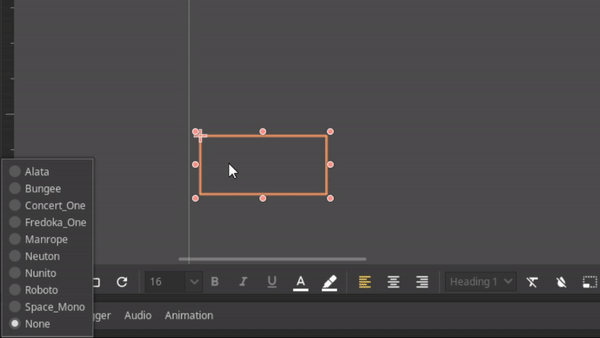

# UI Design Tool

Intuitive UI design workflow in Godot.

Import/manage font source files and styling UI directly in the editor viewport.

## Features

- Import and manage TrueType fonts(.ttf)
- Edit text directly in editor viewport
- Basic styling operations:
  - Font type
  - Font weight
  - Font size
  - Font color
  - Highlight
  - Horizontal alignment
  - Font Style/Formatting(Typography hierarchy)
  - Clear font
  - Clear color
  - Rect size refresh

## Installation

- Install directly from Godot Asset Library

or

- Download this respository,
  1. Move `addons/ui_design_tool` to your `{project_dir}`
  2. Enable it from Project -> Settings -> Plugins

## Usage

### Toolbar

Select any `Control` node will show the toolbar at the bottom of 2D screen viewport, otherwise, it will stay hidden.

### Overlay Text Editor

Double click on `Control` node with `text` property(`Label`, `Button`, `RichTextLabel`, etc...) will show overlay text editor at mouse position.

### Import TrueType Font(.ttf)

Click on  to select the root directory where your font source directories located.

Make sure the selected directory and filenames are structured as below:
- {root_dir}
  - {font_dir}
    - {font_filename}{- or _}{weight_name}
	- ...
  - ...

Example:
- fonts/
  - Arial/
    - Arial-Regular.ttf
	- Arial-Bold.ttf
	- Arial-Italic.ttf
	- Arial-BoldItalic.ttf
  - Courier/
    - Courier_Regular.ttf
	- Courier_Bold.ttf
	- Courier_Italic.ttf
	- Courier_BoldItalic.ttf
  - ...

> Folder name of the font will be used as the font name in toolbar

Click on  to refresh the font list upon any changes made to the font sources.

Supported weight names (non case sensitive)

- thin
- extralight
- light
- regular
- medium
- semibold
- bold
- extrabold
- black
- extrablack

Supported italic weight names (non case sensitive):

- thinitalic
- extralightitalic
- lightitalic
- regularitalic/italic
- mediumitalic
- semibolditalic
- bolditalic
- extrabolditalic
- blackitalic
- extrablackitalic
